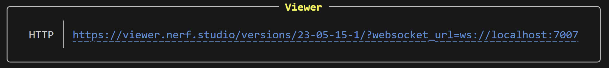
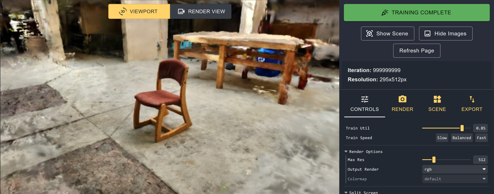
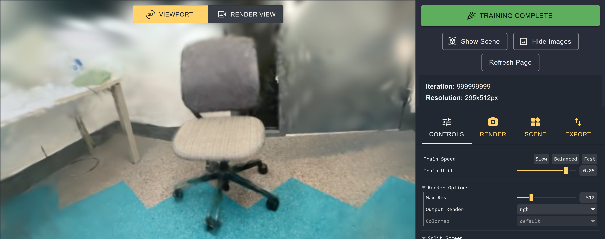
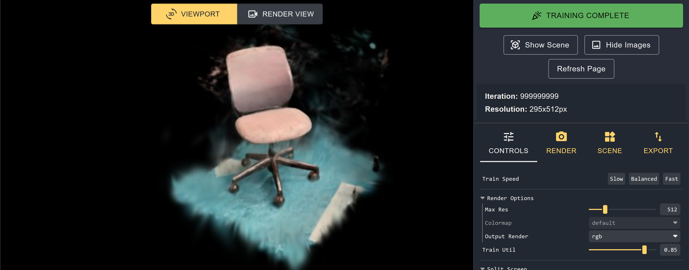
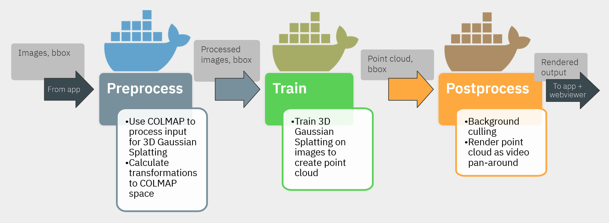
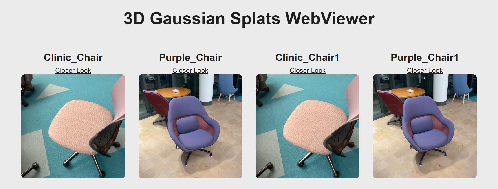
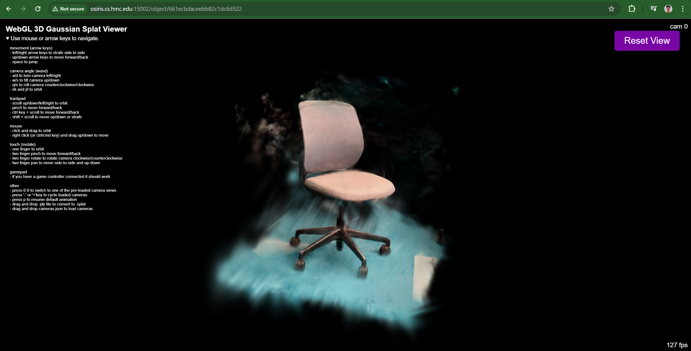
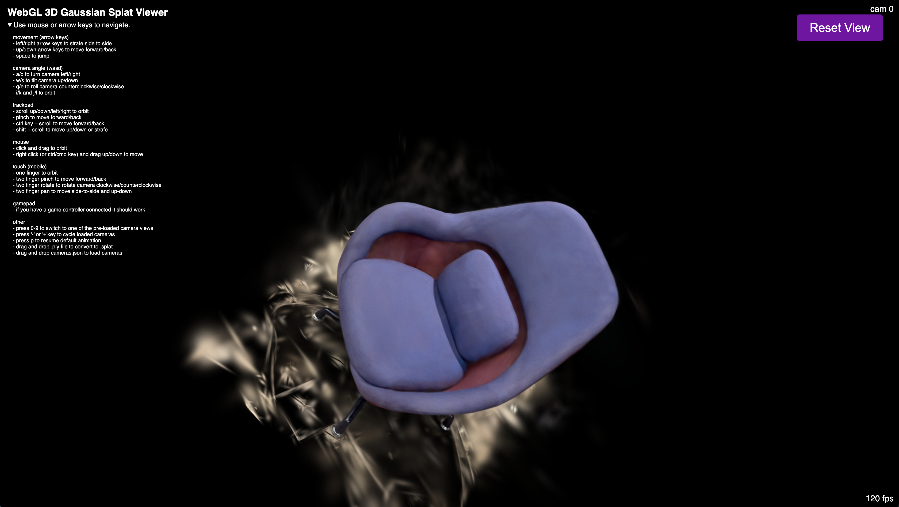
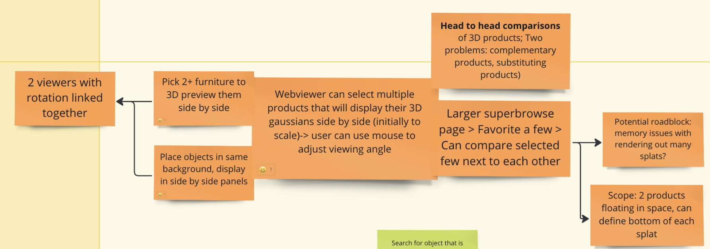

# Server
## Set Up/Installation

### Server Dockerfiles Documentation
#### Building Docker images for Server Pipeline
The server provides 3 Docker images for each of the preprocessing, training, and rendering steps, but you will need to build these Docker images in order to run the server.

In the directory [`Dockerfiles/Preprocess_Dockerfile`](./Dockerfiles/Preprocess_Dockerfile), build with
```bash
sudo docker build -t preprocess .
```

In the directory [`Dockerfiles/Train_Dockerfile`](./Dockerfiles/Train_Dockerfile), build with
```bash
sudo docker build -t train .
```

In the directory [`Dockerfiles/Render_Dockerfile`](./Dockerfiles/Render_Dockerfile), build with
```bash
sudo docker build -t nerfstudio .
```
#### Nerfstudio with Gaussian Splatting
Outside of the server pipeline, you may wish to manually view or render Gaussian Splats for testing purposes. 

We recommend that you put any data you want to mount into the Docker environment into the [`nerfstudio_gaussviewer/nerfstudio`](public/nerfstudio_gaussviewer/nerfstudio) folder.

From the directory [`public/nerfstudio_gaussviewer`](public/nerfstudio_gaussviewer), enter the Docker environment with the following command:
```bash
sudo docker run --gpus all -p 7007:7007 --rm -it -v /home/hmc-cs/nerfstudio_gaussviewer:/nerfstudio_gaussviewer --shm-size=12gb nerfstudio
```

Inside the Docker environment, cd into the directory `/nerfstudio_gaussviewer/nerfstudio`. Then, run the following command:

```bash
pip install ./submodules/diff-gaussian-rasterization ./submodules/simple-knn # install custom submodules
```

Once this is done, you are ready to use any viewer or render commands.

##### Viewing or rendering NeRFs
We recommend using [Nerfstudio Documentation](https://docs.nerf.studio/reference/cli/index.html) as reference for working with Neural Radiance Fields.

##### Viewing splats
The generic viewer command is as follows:
```bash
python nerfstudio/scripts/gaussian_splatting/run_viewer.py --model-path <data path to Gaussian Splatting folder>
```
The terminal will then print out a link to the viewer which can be opened with your web browser.


A few sample datasets are provided with the following commands.

```bash
python nerfstudio/scripts/gaussian_splatting/run_viewer.py --model-path data/atwood-chair-medium
```


```bash
python nerfstudio/scripts/gaussian_splatting/run_viewer.py --model-path data/eric-clinic-chair-trained-output
```


```
python nerfstudio/scripts/gaussian_splatting/run_viewer.py --model-path data/testing6
```
##### Rendering splats
The generic viewer command is as follows:
```bash
python nerfstudio/scripts/gaussian_splatting/render.py camera-path --model-path <data path to Gaussian Splatting folder> --camera-path-filename <data path to camera path json> --output-path <data path to output mp4>
```

For example:
```bash
python nerfstudio/scripts/gaussian_splatting/render.py camera-path --model-path data/atwood-chair-medium --camera-path-filename data/atwood-chair-medium/camera_path.json --output-path data/atwood-chair-medium/renders/output2.mp4
```

### Database
We installed mongodb by doing `sudo apt update` and `sudo apt install mongodb`. Our mongodb version is below:
```
db version v7.0.7
Build Info: {
    "version": "7.0.7",
    "gitVersion": "cfb08e1ab7ef741b4abdd0638351b322514c45bd",
    "openSSLVersion": "OpenSSL 3.0.2 15 Mar 2022",
    "modules": [],
    "allocator": "tcmalloc",
    "environment": {
        "distmod": "ubuntu2204",
        "distarch": "x86_64",
        "target_arch": "x86_64"
    }
}
```

## Running the Server

### Input 
The server receives the input to the model as a .zip file from the iPad. This file contains a set of RGB images, a set of depth images (that we currently do not use but we do save), a .json file that has the camera pose of each image (which we name `app_camera_poses.json`), and a .json file for the bounding box (which we name `boundingbox.json`). We save the .zip file and the unzipped form of that file to the folder `public/tmp_uploads`. 

The color images are then copied over from the unzipped .zip file into the folder `public/uploads/model_input/<splatName>/input`. You will notice that this folder has a lot of other folders and files in it. This is because when we run the command to preprocess these images, it automatically populates the directory that the `/input` folder is in with other folders and files.

The depth images are copied over from the unzipped .zip file into the folder `public/depth_images/<splatName>/input`. 

### Computation
The server runs three main steps to transform our input images into a 3D gaussian splat and a render of this splat. These steps are referred to as preprocess, train, and render.



#### Preprocess Step
First we have the preprocessing step which takes the input images in the folder `public/uploads/model_input/<splatName>/input` and runs them through COLMAPs structure from motion script to create output folders and files that are used as input to 3D gaussian splatting. Note that the input images must be in a folder named `input` for the COLMAP function to work. This process is primarly done in the `runPreprocessCommand(<splatName>)` function. 

We save the output of this step into the folder `public/model_output/post_preprocessing/<splatName>`.
 
#### Training
Next, we use the output of our preprocessing step in our training step. This process is primarly done in the `runTrainCommand(<splatName>)` function. It first starts by mounting the preprocessed output folder into a docker container and then running the 3D gaussian splatting model on this folder while inside the docker container. We then save the output of the model to the server file system in the folder `public/model_output/post_train/`. 

Inside of this folder there is a `point_cloud.ply` file that contains the splat content and a cameras.json file that contains the camera pose for each image in the model's frame. We use the `cameras.json` file and the `app_camera_poses.json` file (sent to us from the iPad) find a 4x4 homography matrix between the app's coordinate frame and the model's coordinate frame. We then use this matrix to transform the bounding box in the app's frame (which is in the boundingbox.json) to be a bounding box in the model's frame. We store the model's bounding box in `public/boundingbox_folder/<splatName>/model_boundingbox.json`. This is done with the script found at `public/scripts/get_bounding_box_model_frame.py`. This bounding box is used to cull the background splats that aren't in the bounding box. The culling is done with the script at `public/scripts/ply_cull.py`, which is documented [here](public/scripts/ply_cull_documentation.md). We overwrite the original splat file name (which is `point_cloud.ply`) with the culled splats. However, we save the original splats as the file `original_point_cloud.ply`. 

We also create a camera path file that will let us render a video of the splat. We do this by using the script found at `public/scripts/get_camera_poses.py`.This camera path file overwrites the file cameras.json because the 3rd party method we use to create the video does so with the cameras.json file. However, we save the original cameras.json content as original_cameras.json in the same directory.

Note that all the .ply files and .json files mentioned above are saved to the folder `public/model_output/post_train/<splatName>/output/<splatName>/`. 

We then copy this folder with all of our output into the folder `public/nerfstudio_gaussviewer/nerfstudio/model_output/post_train/<splatName>`. We have to do this and we can't just mount the `public/model_output/post_train/<splatName>/output/<splatName>/` folder because when we mount the docker container in the next step (render step) it has to mount the nerfstudio_gaussviewer folder. (This is a product of us having trouble settnig up our render docker image).

We also convert our culled splat in the `point_cloud.ply` file to be in the .splat file format. We do this with the antimatter webviewer convert.py file (which is in the `public/webviewer/` directory). The webviewer needs this .splat file format to display the splat. We save this .splat file to `public/splat/<splatName>/output.splat`.

#### Rendering
Next, we use the camera path we created in `cameras.json` and the culled splat we created in `point_cloud.ply` to render a video of our splat. This is done in the `runRenderCustomPathCommand(<splatName>)` function. 

The video of our rendered camera path is saved to `public/model_output/post_render/<splatName>/output_video.mp4`.

### Display
We display our splats on the antimatter webviewer which can be accessed at `<server-ip-address>/webviewer/`. The original antimatter webviewer github can be found here: [Antimatter Github Link](https://github.com/antimatter15/splat). When you hover over the splat you want to view, the video made in the rendering step is displayed over the splat. When you click on the link, it sends you to a webpage where you can see the splat and view it from different angles. 

Below shows the webviewer page when you go to `<server-ip-address>/webviewer/`:


Below shows the splat that can be viewed in the webviewer when you go to the page `<server-ip-address>/object/<mongodb-splat-hash>`:


### Sending Data To App
During the process of pre-processing the images, training the splat, and rendering the video, the app polls the server our status (which step we are on). We store the status in a variable called `status` that can have the types found in the constant field `statusTypes`.

When the statusType of the server is `RENDERING_ENDED`, the app polls the server to download the video that we have created and polls the server to get the link to the splat on the webviewer. The section for the webviewer is below. 

### Database
The Mongo database is used to keep track of all of the filepaths necessary to access important information about the splat. For example, the database has the link to access to splat online, it has the file path to the .splat file, the .ply files, the .mp4 file, and more. We create the database on the computer offline and we have it continually running in the background so it is up whenever the server runs. We use the commands `sudo systemctl start mongod` and `mongosh` to start the database and then `sudo systemctl stop mongod` to stop the database.

## File System
Below are the files and folders relevant to running the server (not including the webviewer)
```
server-code
│---README.md
│---server.js    
│
└───public
│   └───app_camera_transforms_folder/*
│   └───boundingbox_folder/*
│   └───depth_images/*
│   └───model_output/*
│   └───nerfstudio_gaussviewer/*
│   └───raw_device_uploads/*
│   └───scripts/*
│   └───splat/*
│   └───tmp_uploads/*
│   └───uploads/*
└───views/
│   │---upload.ejs
```

## Active Bugs / Useful Information
1. You have to run the server with a specific version of node.js. This version is 16.20.2. If you do not run it with this, some of the libraries won't work. 
2. If there are too few images in the dataset then there will be an error because of imaginary numbers. This may also happen if a lot of your pictures are blurry since the preprocessing step will get rid of those pictures.
3. The nerfstudio container for rendering is special. We could not get it to work fully with just the docker image so you must always mount the public/nerfstudio_gaussviewer directory and install two pip submodules from that directory: `/nerfstudio_gaussviewer/nerfstudio/submodules/diff-gaussian-rasterization` and `/nerfstudio_gaussviewer/nerfstudio/submodules/diff-gaussian-rasterization`. 

## Future Work
1. Allow multiple users to train models at the same time
2. Transition from storing data on the file system to fully using a database

------------------
# WebViewer
## Overview
To visualize the radiance fields, we chose to render them on a website since it's been proven that 3D Gaussian Splats can be rendered on websites in real-time. Upon doing research, we found an open source example from [antimatter15/splat](https://github.com/antimatter15/splat) that used WebGL to implement a real-time renderer. We based the rest of our WebViewer from this (commit at time of forking:`b2cf38c`).

From this, we created a gallery page that would allow the user to quickly preview all 3D Gaussian Splats (shorthand is *splat*) that our server has created. For each splat, we display a title, a link to a webpage that will render the splat (based on the antimatter15 splat project), and a preview image. 


If the user clicks the "Closer Look" text, it will bring them to a webpage that loads the corresponding 3D Gaussian Splat, and the user can use their mouse, keyboard, or trackpad to alter the angle they're viewing the splat.


To run the webviewer, you must start the server as described above. 

## File Structure and File Description
These are the files relevant to the webviewer. 
```
server-code
│---README.md
│---server.js    
│
└───public
│   │---main.js
│   │
│   └───webviewer
│       │---gallery_style.css
│       │---LICENSE
│       │---README.md
│       │---style.css
└───views
│   │---gallery.ejs
│   │---index.ejs
```

Here is a high-level description of each file and its relevance to the webviewer:

1. `server-code/README.md`: It's this file! This gives a high-level overview of the webviewer, the features we added, any known bugs, and future work. 
2. `server-code/server.js`: When this file is run, it starts up the webviewer and can be viewed on this link: http://osiris.cs.hmc.edu:15002/webviewer/. This file goes through the database to dynamically make a webpage for each splat and fill the HTML content related to each splat on the gallery page (title, link to webpage that renders splat, preview image, rendered 360 degree video of splat).
3. `server-code/public/main.js`: This is the javascript code that's running in the background on a page that renders the splat (`index.ejs`). This controls the camera views, the keyboard/mouse controls, and renders the splat (WebGL). Note that this is almost identical to the `main.js` from the antimatter project. The only significant changes are where the splat file is being downloaded from and the reset view feature described below. 
    1. There is a  `main.js` file in the `public/webviewer` folder. This is the original antimatter `main.js` file and it is not used in our server. 
4. `server-code/public/webviewer/gallery_style.css`: This is the CSS style for the `gallery.ejs` file.
5. `server-code/public/webviewer/LICENSE`: This is the license from the Antimatter15 project.
6. `server-code/public/webviewer/README.md`: This has more detailed information on the files in `server-code/public/webviewer/`.
7. `server-code/views/gallery.ejs`: This holds the HTML template for the gallery page of webviewer.
8. `server-code/views/index.ejs`: This holds the HTML code for the webpages that render the webviewer. 

## Features
Here's a description of all the features we have implemented, adding on from the antimatter15 splat repository. 

1. **Dynamically form Gallery View and individual webpages from Mongo database**: This is done in the `server-code/server.js` file. To form all the HTML content for the webviewer that accurately represents all the splats we've created, we do two things. First, we store all the information related to the splats in a Mongo database. Second, when we run the server, the `server.js` file goes through each item in the Mongo database, and it creates a webpage using the HTML template in `index.ejs` and fills the gallery items in `gallery.ejs`. For the `index.ejs`, the server passes in the `splatPath` of the splat and the `main.js` file uses the path to download the splat file. 
2. **Gallery View**: The goal of the gallery view is to allow the user to quickly preview all the items we've created splats of. As mentioned above, we use the database to dynamically fill the gallery. Each item in the gallery consists of the title, link to webpage with splat, preview image, and video of splat (360 degree generated by server). One thing to note is that only the image or video will be shown (not both). In the `gallery.ejs`, there's a script that checks if the user's mouse has hovered over the image. If it has for more than 0.25 seconds, it will stop showing the image and show the video instead. 

3. **Reset View**: When interacting wih the splat in the webviewer, it's possible that the user may lose sight of the splat or end up in some convoluted position/view. As a result, we added a reset view feature, where there user can either press the "Reset View" button in the top right corner or press `r`. One thing to note is that in the orignal antimatter project, they have a carousel feature that's initially enabled (performs some sort of orbiting motion around the splat), and when we reset the view, we also start the carousel again.

## Known Bugs
1. Video preview: One bug we've noticed occasionally is that when the user's mouse hovers over the preview image, it will start to play the video instead, but then quickly show the image, and then continue playing the video. If the user hovers in the rectangular region that encapsulates the title, link and image but not over the image, this behavior does not occur. 

## Future Work
1. **Adjust navigation**: One thing we noticed when changing the camera angle was that it was easy to end up in a strange angle where it was hard to view the splat. We did try to explore a more intuitive navigation system that was similar to the navigation style found here: https://gsplat.tech/amethyst/. This works by keeping the camera pointed at the center of the object and when the user drags their mouse, the camera will orbit around the center. The user can zoom in and out on the center, and they can also select a new center by click on the screen where they want the new center to be. Unfortunately, when we tested out how to point the camera to the center of the object using the `model_boundingbox.json` information, we weren't successful. Due to lack of time, we weren't able to pursue further exploration. However, we believe improving the navigation would help improve the user experience.
2. **Improve UI**: We focused on implementing the core features above, so not much time was spent in making the UI aesthetic. 
3. **Search bar**: As more splats get added to the database, we may want some way to search for a specific splat or filter for certain splats based on tags we can add to the splats. 
4. **Save multiple splats and do a side by side comparison**: Before making the webviewer, we did some brainstorming on how we could visualize the splats. This became a stretch goal we weren't able to achieve but one idea we had was to allow the user to save multiple splats (similar to adding to a liked list), and choose 2 to compare side by side. This would allow easier comparison of products. Since we have the suppliers place a bounding box around the objects and we successfully remove most of the background, we can use the bottom plane of the bounding box to act as the "floor" and have the splats vertically aligned to the same ground plane. This would allow us to do things like compare height. Here's a screenshot from the brainstorm.
